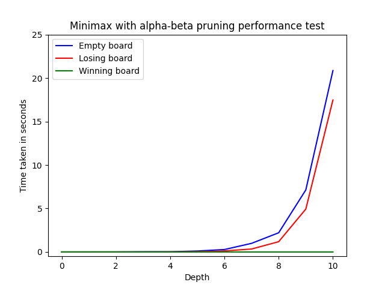

Vaadittavat kirjastot: Pygame ja Numpy

### Ohjeet Pygamen asennukseen: https://www.pygame.org/wiki/GettingStarted

### Ohjeet numpyn asennukseen: https://numpy.org/install/

## Pelaa tekoälyä vastaan komennolla:
python AIConnectFour.py

## Pelaa kaksinpeliä komennolla:
python ConnectFour.py

## Käyttöohje

Connect Four on yksinkertainen vuoropohjainen lautapeli, jossa tavoitteena on saada itselleen neljä pelinappulaa sivuttain, pitkittäin, tai vinottain. Fyysisessä muodossa pelinappula pudotetaan laudan yläreunasta johonkin pelaajan valitsemaan sarakkeeseen, jolloin se tippuu pelilaudalla kunnes vastaan tulee pohja tai toinen pelimerkki. Peli päättyy, kun jompi kumpi pelaajista saa neljän suoran, tai pelilauta menee täyteen, jolloin syntyy tasapeli. 

Suorita komento **python AIConnectFour.py** pelataksesi tekoälyä vastaan, niin peli-ikkuna aukeaa. Tämän jälkeen peli ilmoittaa, kumman vuoro on aloittaa. Kun peli sanoo, 'human's turn', on sinun vuoro valita hiirellä haluamasi sarake, minne pelinappula putoaa. Tämän jälkeen tekoäly valitsee siirtonsa, kunnes on taas sinun vuoro valita. Peli etenee kunnes jompi kumpi voittaa. Peli alkaa alusta 4-sekunnin kuluttua.

Jos haluat pelata kaveriasi vastaan, suorita komento **python ConnectFour.py**. Peli toimii samankaltaisesti, mutta nyt vuoron vaihtuessa on kaverisi vuoro pelata.

