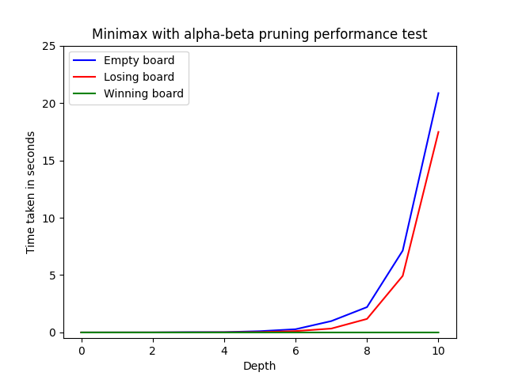

### Testaa toimivuus juuressa komennolla (Windows 10):
 python -m unittest -v test.test_minimax

## Testiraportti:

Yksikkötestauksessa testasin pelilogiikan toimivuuden ja kaikki edge-caset. Normaalit pelin funktiot kuten laillisten pelipaikkojen määrittelemisen, pelinappulan pudottaminen, ja voittotilanteen tunnistaminen käytiin täsmällisesti läpi. Sen lisäksi testasin minimax-algoritmin oikeutta, ja tein testejä eri pelitilanteen määrittelemiseksi. Testaaminen onnistuu myös ihan peliä pelaamalla. Kaikki olennaiset metodit ja funktiot joille testien tekeminen on järkevää on testattu. Testejä itseään pääsee tarkistamaan test/test_minimax.py ohjelman koodista.

test_ai (test.test_minimax.MinimaxTest) ... ok
test_change_turn (test.test_minimax.MinimaxTest) ... ok
test_children (test.test_minimax.MinimaxTest) ... ok
test_draw (test.test_minimax.MinimaxTest) ... ok
test_evaluation (test.test_minimax.MinimaxTest) ... ok
test_score (test.test_minimax.MinimaxTest) ... ok
test_winning (test.test_minimax.MinimaxTest) ... ok

----------------------------------------------------------------------
Ran 7 tests in 0.014s

OK

## Suorituskykytestit kolmelle eri pelitilanteelle

Alla olevassa kaaviossa näkyy miten nopeasti minimax alpha-beta pruning-algoritmi toimii eri pelitilanteissa. Kuten huomataan, tyhjän pelilaudan ja häviämistilanteen arvioimisessa menee erittäin kauan, vaikka haluaisimme häviämistilanteen tunnistettavan välittömästi. Tämä johtuu algoritmin luonteesta. Sen hetkinen pelaaja pyrkii aina maksimoimaan/minimoimaan pisteensä riippuen kumpi pelaaja on pelaamassa. Samalla toinen pelaaja pyrkii vastakkaisesti minimoimaan/maksimoimaan pisteensä puun alemmalla tasolla. Vaikka häviön välttävä siirto löydettäisiin heti ensimmäisenä, ei algoritmi tunnista tätä parhaaksi vaihtoehdoksi koska se ei lähes ikinä anna hyviä pisteitä. Tästä syystä algoritmi käy lähes kaikki tasot läpi etsien parempaa tulosta kunnes, päätyy valitsemaan huonon pisteiden minimoivan siirron; häviön välttämisen. Pruningia tapahtuu joka tapauksessa etenkin suuremmissa syvyyksissä, kun peli on edennyt pidemmälle ja voittotilanteet ovat havaittu.

Alpha-beta pruning toimii erinomaisesti voittotilanteessa, jolloin kaikilla valitsemilla syvyyksillä menee sama aika, joka on lähes välitön.